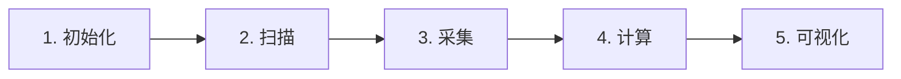

# SRAM Static Noise Margin (SNM) Generation Tool

## Overview

This Python-based tool provides visualization support for analog simulations by generating Voltage Transfer Characteristic (VTC) graphs and calculating Static Noise Margin (SNM) for SRAM cells.

## 工作流程演示

  
   
  
  
  

  <small>图：SRAM SNM分析五步工作流程</small>

---

## Key Features

- **Supports two analysis modes**:
  - Static/read analysis (`SNM_twosquare.py`)
  - Write analysis (`SNM_onesquare.py`)
- **Processes simulation data from Cadence Virtuoso**
- **Automatically identifies SNM through largest square fitting**
- **Generates professional VTC plots with SNM visualization**

---

## System Requirements

- **Programming Language**: Python 3
- **Recommended IDE**: PyCharm
- **Dependencies**:
  - `matplotlib`
  - `pandas`
  - `numpy`

---

## Usage Instructions

### 1. Simulation Data Preparation

- Perform simulations in Cadence Virtuoso ADE L.
- Export sweep results for both left and right voltage nodes as CSV files.

### 2. Tool Configuration

- For static/read analysis, use `SNM_twosquare.py`.
- For write analysis, use `SNM_onesquare.py`.

### 3. File Setup

- Edit the input file paths in the Python script to point to your CSV files.
- Specify your desired output filename.
- **(For `SNM_twosquare.py` only)**: Set an appropriate cutoff voltage for loop separation.

### 4. Execution

- Run the Python script.
- The tool will:
  - Process the simulation data.
  - Generate VTC plots.
  - Calculate and display SNM.
  - Save the graph image in the script's directory.

---

## Performance Notes

- The largest square fitting algorithm provides approximate results.
- Accuracy depends on simulation sampling rate.
- **Recommended**: Use fewer than 1000 sample points for optimal processing time.

---

## Output

The tool generates an image containing:

- Complete VTC characteristics.
- Identified SNM square regions.
- Calculated noise margin values.

---
